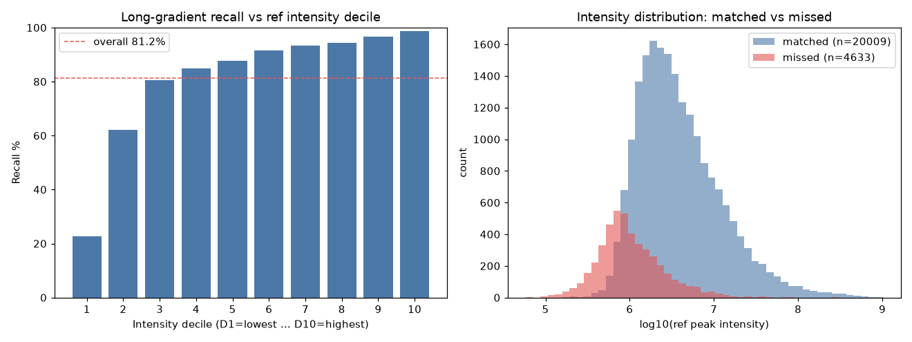

# Long-gradient missed peaks vs intensity — is the 81.2% recall gap low-abundance?

**Question.** On the 120-min IonStar file the detector's resolved-feature recall is 81.2%
(20,009/24,642 MSMS ref peaks matched), leaving ~4,600 FlashLFQ-quantified peaks unrediscovered.
Do those misses live in the bottom ~10% of intensity — i.e. is the 90%-TIC-coverage cutoff dropping
low-abundance peptides?

**Method.** Matched vs missed split of the 24,642 MSMS ref peaks
(`long_ground_truth_msms.tsv`) against the 96,058 resolved features
(`long_features.tsv`), using the headline recall criteria: |mono − ref mono| ≤ 20 ppm AND
|apex RT − ref RT| ≤ 0.3 min. This reproduces exactly the 81.2% figure and gives **4,633 missed**
peaks (matches the ~4,600 headline). Intensity is the ref `Peak intensity` field. (Requiring charge
match too gives 79.0% / 5,187 missed; the analysis below uses the mass+RT definition that the ~4,600
number refers to.)

## Recall per intensity decile (D1 = lowest intensity … D10 = highest)

| Decile | #ref | #matched | recall % | intensity range |
|---|--:|--:|--:|---|
| D1  | 2,464 | 557   | **22.6%** | 5.8e4 – 7.7e5 |
| D2  | 2,464 | 1,532 | 62.2% | 7.7e5 – 1.13e6 |
| D3  | 2,464 | 1,982 | 80.4% | 1.13e6 – 1.51e6 |
| D4  | 2,464 | 2,093 | 84.9% | 1.51e6 – 1.95e6 |
| D5  | 2,465 | 2,160 | 87.6% | 1.95e6 – 2.57e6 |
| D6  | 2,464 | 2,254 | 91.5% | 2.57e6 – 3.44e6 |
| D7  | 2,464 | 2,298 | 93.3% | 3.44e6 – 4.92e6 |
| D8  | 2,464 | 2,323 | 94.3% | 4.92e6 – 7.79e6 |
| D9  | 2,464 | 2,379 | 96.6% | 7.79e6 – 1.53e7 |
| D10 | 2,465 | 2,431 | **98.6%** | 1.53e7 – 1.01e9 |

Recall rises monotonically with intensity: **D1 22.6% → D10 98.6%**. The top three deciles are already
at 94–99% (near the 10-min ~97% reference); essentially all of the deficit lives in the bottom two
deciles, and half of it in D1 alone.

## Where the misses concentrate

- **Bottom 5%** of ref intensity holds **23.8%** of all missed peaks.
- **Bottom 10%** holds **41.2%** of all missed peaks.
- **Bottom 20%** holds **61.3%** of all missed peaks.

Of the 4,633 misses, 2,332 (50.3%) sit in D1 and D2 combined (the bottom fifth of intensity accounts
for ~1,900 of the ~4,600-peak gap). By contrast the top half of intensity (D6–D10) contributes only
~750 misses total.

## Median-intensity comparison

| set | Q1 | median | Q3 |
|---|--:|--:|--:|
| missed  | 5.74e5 | **8.90e5** | 1.66e6 |
| matched | 1.70e6 | **3.19e6** | 7.43e6 |

Median intensity of missed:matched = **0.279** — missed peaks are ~3.6× dimmer at the median. The
missed Q3 (1.66e6) barely reaches the matched Q1 (1.70e6): three-quarters of misses are dimmer than
three-quarters of matches.

## Verdict

**The evidence strongly supports the low-abundance / coverage-cutoff hypothesis.** Missed peaks are
overwhelmingly low-intensity: recall is a clean monotone function of intensity (D1 22.6% → D10 98.6%),
missed peaks are ~3.6× dimmer than matched at the median, and 41% of all misses fall in the bottom
intensity decile with 61% in the bottom quintile. The detector recovers high-abundance peptides at
short-gradient quality (top deciles 94–99%); the ~4,600-peak gap is almost entirely the faint tail.
This is consistent with the seed-floor / 90%-TIC-coverage cutoff exhausting before it reaches the
lowest-abundance IonStar peptides (hypothesis (c) in `Longer-Gradient-Recall.md`), rather than a
uniform placement/linking failure across intensities. It does not, by itself, distinguish "coverage
cutoff stops early" from "these peaks are too dim to seed at all" — but it does point the follow-up at
the low-abundance seeding/coverage budget, not at the RT/charge-linking machinery. Note the gap is not
confined to a literal bottom 10%: it extends through D2–D3 (62% and 80% recall), so raising the
coverage budget would need to reach roughly the bottom third of intensity to close most of it.
